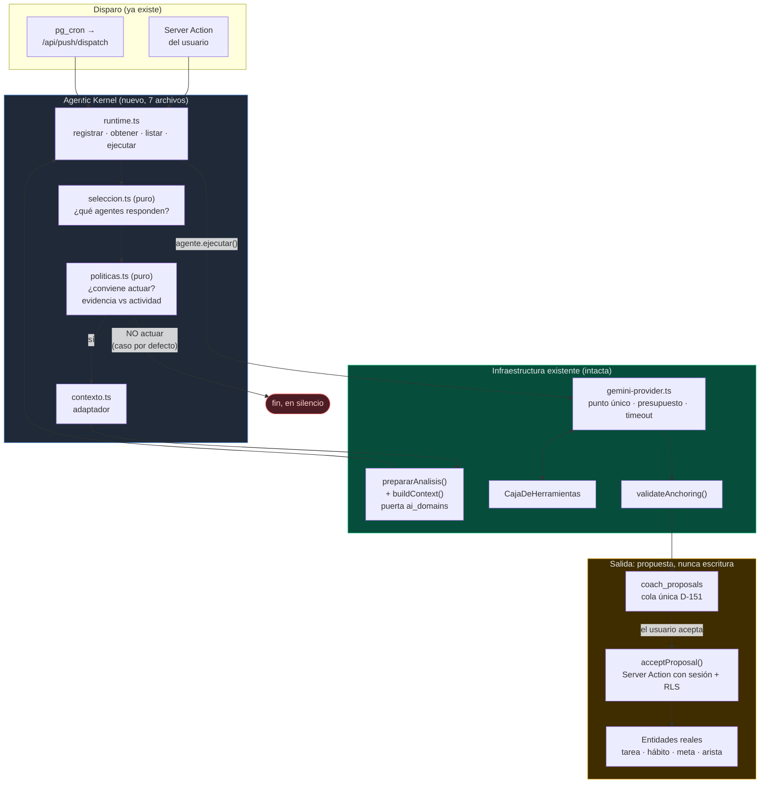

# Agentic Kernel — arquitectura

**Fecha:** 2026-09-20 · **Estado:** propuesta, pendiente de aprobación. No se ha escrito código.

> **Sobre la fuente de la visión.** El encargo mencionaba un `OBJETIVO.txt` adjunto.
> **Ese archivo no existe** en el repositorio ni se aportó por otra vía; lo busqué en
> todo el proyecto. Este documento se apoya exclusivamente en (a) el texto del encargo
> y (b) lo que el repositorio dice de sí mismo. Si la visión contiene algo que
> contradiga lo que sigue, manda la visión.

> **Ubicación.** El encargo pedía `AGENTIC_KERNEL_ARCHITECTURE.md` sin ruta. Va en
> `docs/` porque ahí viven ya `DECISIONS.md`, `CHECKS.md`, `SECURITY.md`,
> `TRACEABILITY.md` y `UNIVERSAL_GRAPH_ROADMAP.md`. La raíz solo tiene `README.md`.

---

## 1. Estado actual del repositorio

Descriptivo. Nada de esto es aspiración.

### Lo que hay

| Capa | Dónde | Qué es hoy |
|---|---|---|
| Llamada al modelo | `src/lib/ai/gemini-provider.ts` | **Punto único en TS**. Sin SDK (D-087), `fetch` directo. Presupuesto **obligatorio** por feature, `TIMEOUT_MS = 60_000`, cadena de modelos con salto en 429, `MAX_RONDAS_HERRAMIENTAS = 4`. Nunca lanza. |
| Herramientas | `src/lib/ai/tools.ts` | `CajaDeHerramientas`: `leer_hechos`, `consultar`, `explorar_grafo`, `buscar_en_internet`. Declaraciones filtradas según el llamador tenga sesión o no. |
| Hechos | `src/lib/domain/insights/facts/*` + `src/lib/insights/facts-loader.ts` | 11 extractores **puros**. El modelo no calcula: recibe `Fact { id, domain, label, weight, refs }` y redacta. `validateAnchoring` tumba lo que cite un hecho inexistente. |
| Contexto | `src/lib/insights/context.ts` | `buildContext()`, `allowedDomains()`, `TABLAS_CONSULTABLES`. **El filtro de privacidad canónico (D-027).** |
| Propuestas | `coach_proposals` (0053) | Cola única (D-151). Tipos y estados cerrados por `check` en la base. |
| Memoria | `memory_items` (0008) + `src/lib/domain/insights/memory.ts` | Declarativa, editable, **caducable**. `MAX_MEMORY_ITEMS = 20`. Sin embeddings, por invariante. |
| Grafo | `graph_nodes`/`graph_edges` + `src/lib/domain/graph/*` | Proyectado **desde las tablas por triggers SQL**, no desde TS. Vocabulario en la base; `catalog.generated.ts` rompe la compilación si TS se desalinea. |
| Identidad objetivo | `identity_profiles`, `identity_revisions` (0064) | `desired_identity`, `vision_statement`, `core_values`. Un trigger guarda el estado anterior en cada cambio. |
| Aprendizaje | `src/lib/domain/identity/estilo.ts` (D-164) | Mide qué tono/longitud/escena funcionó y ajusta el prompt. Umbrales `minDias:14, minN:7, minSinN:4, minLift:6`. |
| Reglas deterministas | `src/lib/domain/automations/rules.ts` | `decide(event, automations): Decision[]`. Sin IA, a propósito. |
| Núcleo de agentes | `src/lib/domain/agents/*`, `src/lib/agents/runtime.ts` | **PR #57 / D-170.** Tipos, contrato, registro, punto de entrada. Registro vacío, nadie lo llama. |

86 tablas vivas, 178 políticas RLS, 45 suites pgTAP (~429 asserts), 1 225 tests unitarios.

### Los tres huecos reales

1. **No hay event store.** Ninguna tabla `events`/`timeline`/`activity_log` genérica. Lo más cercano es `audit_log` (append-only: `action`, `object`, `meta`). No hay event sourcing.
2. **El trayecto de contexto está escrito cuatro veces.** `buildContext()` es compartido, pero el camino que lo alimenta —leer `ai_domains`, interseccionar, leer `memory_items`, cargar hechos, cargar cadenas— se repite en `generar-recomendaciones.ts`, `coach/daily.ts`, `ai-chat/actions.ts` y `identity/agent-context.ts`, con variaciones.
3. **El aprendizaje por aceptación no existe.** Solo el rechazo realimenta (`feedsRejectionContext`), y solo el brief tiene bucle de resultado medido.

### El antecedente que condiciona todo

El **2026-09-13** se aprobó un diseño llamado *Sistema cognitivo*
(`docs/superpowers/specs/2026-09-13-sistema-cognitivo-design.md`) con el bucle
`Percibir → Conectar → Anticipar → Proponer → Ejecutar → Aprender`, fases C→A→E→L y
decisiones D-150…D-154.

**Verificado el 2026-09-20:**
- **Fase C: construida y fusionada.** PR #37 MERGED, migración `0062_conecta.sql` en `main`.
- **Fases A, E y L: nunca construidas.** No existen `facts/forecast.ts`, `facts/correlations.ts`, `outcomes.ts` ni `ai/plan-mission.ts`. **Ninguna migración menciona `missions`.** Las migraciones `0063`–`0071` fueron a identidad → ritual → centro.

El spec dice «diseño aprobado» y no marca en ningún sitio que se abandonara. Leerlo
induce a creer que el bucle está cerrado. **No lo está.**

---

## 2. Componentes reutilizables

Lo que el Kernel **usa tal cual**, sin envolver ni copiar.

| Se reutiliza | Ruta exacta | Para qué en el Kernel |
|---|---|---|
| `generateJson<T>()` | `src/lib/ai/gemini-provider.ts` | Único camino al modelo. Un agente que llame por su cuenta es un bug. |
| `Budget` + los seis presupuestos | `src/lib/ai/gemini-provider.ts` | Cada agente declara el suyo. Ya es obligatorio por tipo. |
| `CajaDeHerramientas` | `src/lib/ai/tools.ts` | Las herramientas del agente. **No se crea `tools.ts` en el Kernel.** |
| `prepararAnalisis()` | `src/lib/insights/generar-recomendaciones.ts` | El trayecto de contexto canónico. |
| `buildContext()`, `allowedDomains()` | `src/lib/insights/context.ts` | Puerta de privacidad D-027. |
| `type Domain` (8 valores) | `src/lib/domain/insights/types.ts` | **`AgentDefinition.domains`.** Ata cada agente a la puerta existente. |
| `type Area` (7 valores) | `src/lib/domain/identity/categorias.ts` | **`AgentDefinition.identityServed`.** Verificable, no texto libre. |
| `validateAnchoring()` | `src/lib/domain/insights/anchoring.ts` | Un agente no cita hechos inventados. |
| `coach_proposals` + `acceptProposal()` | migración 0053, `src/lib/coach/actions.ts` | La salida de un agente es una propuesta, no una escritura. |
| `activeMemory()`, `memory_items` | `src/lib/domain/insights/memory.ts` | **No se crea `memory.ts` en el Kernel.** |
| `src/lib/domain/graph/*` | dominio del grafo | **No se crea `graph.ts` en el Kernel.** |
| `libroDeEstilo()`, `UMBRALES` | `src/lib/domain/identity/estilo.ts` | El patrón de aprendizaje, generalizado en Fase 4. |
| `ActionResult` | `src/lib/supabase/errors.ts` | Contrato de resultado. Ya lo usa el registro. |
| `pg_cron` → `/api/push/dispatch` | 0051, `src/app/api/push/dispatch/route.ts` | **No se crea `scheduler.ts` en el Kernel.** |
| `identity_revisions` + su trigger | migración 0064 | El evento `identity.revised` que pide el encargo **ya se emite**, en SQL. |

---

## 3. Componentes que deben modificarse

Tres, y solo tres.

**3.1 `src/lib/domain/agents/types.ts` — extender `AgentDefinition`.**
Hoy tiene `id`, `version`, `descripcion`, `ejecutar`. Le faltan los campos del encargo.
Ver §9. Es extensión pura: nada de lo que existe cambia de forma.

**3.2 `src/lib/domain/agents/contrato.ts` — validar los campos nuevos.**
Mismo patrón (`string | null`). Sin zod: un agente es código propio validado al
arrancar, no dato ajeno de frontera.

**3.3 `src/lib/agents/runtime.ts` — añadir `ejecutar(id, entrada)`.**
El contrato ya está cerrado en el tipo desde D-170. Se añade quién llama.

**Lo que NO se modifica y podría parecer que sí:** las cuatro copias del trayecto de
contexto. Unificarlas es tentador y **no toca en la Fase 1**: el Kernel estrena
`prepararAnalisis` para sus propios agentes, y solo cuando haya dos agentes reales
usándolo se migran los cuatro llamadores, uno por PR, con sus tests. Unificar cuatro
caminos de privacidad sin consumidor que lo ejercite es cómo se rompe una puerta de
privacidad en silencio.

---

## 4. Componentes que permanecen intactos

| Intacto | Por qué |
|---|---|
| Coach (`src/lib/coach/*`) | Funciona, tiene cron y pgTAP. Se registrará como agente cuando el Kernel esté probado, no antes. |
| Manifestation TS + Python (`agents/`) | D-164 ya resolvió autoridad, respaldo, saneado, tope y privacidad. Rehacerlo es regresión. |
| Insights (`src/lib/insights/*`) | Es la pieza que el Kernel **usa**. |
| AI Chat (`src/lib/ai/*`, `src/lib/ai-chat/*`) | Contiene el punto único de llamada y la caja de herramientas. |
| Automations (`src/lib/automations/*`) | Motor determinista sin IA. Que un agente pueda proponer una automatización no significa que el motor cambie. |
| Knowledge Graph / Graphify | BR-012 y el registro declarativo. El Kernel lee por las RPC existentes. |
| Memoria (`memory_items`) | Ya es lo que el encargo pide que sea. |
| El centro y la navegación | El encargo dice no cambiar la UX hasta que el núcleo esté listo. |
| Fase C del sistema cognitivo (`0062`) | Construida y en producción. |

---

## 5. Relación con el Sistema cognitivo (D-150…D-154)

*Sección añadida al índice del encargo. Sin ella, este documento crearía la
arquitectura paralela que el propio encargo prohíbe.*

**Decisión del usuario (2026-09-20): «convive».** Se interpreta en dos mitades,
porque la palabra solo es coherente en una de ellas:

**Con lo construido — convivencia total, como invariante.** La fase C, el coach, el
centro, el brief y las automatizaciones siguen exactamente igual. El Kernel no los
importa, no los modifica y no los reemplaza. Ningún módulo actual importa el Kernel.

**Con lo no construido — no hay dos sistemas, hay dos planos del mismo edificio.**
Si ambos siguen vivos, quien construya misiones dentro de seis meses tendrá que
elegir igual, pero sin que nadie lo haya decidido. Esta tabla decide ahora:

| Pieza sin construir | Plano que manda | Por qué |
|---|---|---|
| Misiones / trabajo multipaso (D-153, fase E) | **Sistema cognitivo** | Está diseñado al detalle, con DAG validado, tope de 25 pasos, reclamo atómico y reanudación. El Kernel no tiene nada mejor que decir. Será **un agente** del Kernel, no un subsistema aparte. |
| Aprendizaje por resultado (D-154, fase L) | **Sistema cognitivo**, generalizado | `outcomes.ts` + `linea_base` es el diseño; `estilo.ts` es la implementación de referencia que ya funciona. El Kernel aporta el sitio donde vive, no el método. |
| Pronósticos y correlaciones (fase A) | **Sistema cognitivo** | Son extractores de hechos puros. No necesitan Kernel para nada. |
| Selección de qué agente actúa | **Kernel** | El sistema cognitivo no lo cubre: asume un solo coach. |
| Restraint / evidencia vs actividad | **Kernel** | Concepto nuevo, no está en ningún plano previo. |
| Registro y contratos de agente | **Kernel** | Es su razón de existir (D-170). |

**Consecuencia editorial:** D-150…D-154 **no se marcan como superadas**. Se anotará
en el spec del sistema cognitivo que las fases A, E y L siguen vigentes como diseño y
que su ejecución pasará por el Kernel.

---

## 6. Arquitectura propuesta

### El principio que la ordena

> **El Kernel decide QUIÉN actúa y SI conviene actuar. No sabe hacer nada.**

Todo lo que sabe hacer algo ya existe. Un Kernel que además construyera contexto,
llamara al modelo, guardara memoria y consultara el grafo sería una segunda copia del
sistema con nombres nuevos.

### Cuántos archivos

El encargo sugería trece. **Se proponen siete, de los cuales cuatro ya existen.**

```
src/lib/domain/agents/        (puro, sin server-only, testeable con node:test)
  types.ts        [EXISTE]  vocabulario — se extiende
  contrato.ts     [EXISTE]  validación — se extiende
  registro.ts     [EXISTE]  el Map<id, agente> — sin cambios
  seleccion.ts    [NUEVO]   qué agentes responden a un evento
  politicas.ts    [NUEVO]   si conviene actuar (restraint, riesgo, autonomía)

src/lib/agents/               (efectos, con server-only)
  runtime.ts      [EXISTE]  punto de entrada — gana ejecutar()
  contexto.ts     [NUEVO]   adaptador fino sobre prepararAnalisis()
```

**Los seis que se descartan, con nombre y motivo:**

| Descartado | Porque |
|---|---|
| `orchestrator.ts` | Es `seleccion.ts` + `politicas.ts` + `runtime.ts`. Un archivo llamado «orquestador» acaba siendo donde va lo que no se supo colocar. |
| `events.ts` | Un `AgentEvent` es un tipo, no un módulo. Cabe en `types.ts`, igual que `AutomationEvent` vive en `rules.ts`. |
| `actions.ts` | **El Kernel no escribe.** La salida de un agente es una propuesta en `coach_proposals`; quien escribe es una Server Action con la sesión del usuario y la RLS de siempre (D-164, D-089). Un `actions.ts` en el Kernel sería la primera grieta en esa regla. |
| `memory.ts` | `domain/insights/memory.ts` ya existe. |
| `graph.ts` | `domain/graph/*` + `src/lib/data/graph.ts` ya existen. |
| `tools.ts` | `CajaDeHerramientas` ya existe. |
| `scheduler.ts` | `pg_cron` → `/api/push/dispatch` ya existe y está probado. |

### Diagrama



La caja roja —**no actuar, en silencio**— es el caso por defecto, no el de error.

---

## 7. Flujo de eventos

**Los eventos no se persisten.** Viven dentro de una petición, exactamente como
`AutomationEvent` desde la migración 0008. No se crea tabla en la Fase 1.

```
1. Algo pasa           Server Action existente (el usuario completa un hábito)
                       o el cron (son las 6:00)
2. Se nombra           AgentEvent { tipo, userId, ocurridoEn, refs }
                       tipo: unión literal cerrada, como TriggerType
3. Selección (pura)    seleccion.ts: agentes con ese trigger, enabled,
                       ordenados por priority. Sin I/O, sin modelo.
4. Restraint (puro)    politicas.ts: por cada candidato, ¿genera evidencia
                       de identidad o solo actividad? ¿riesgo permitido por
                       su autonomía? ¿tope de la franja agotado?
                       → por defecto, NO.
5. Contexto            contexto.ts → prepararAnalisis(): ai_domains ∩
                       agente.domains. Si queda vacío, se corta aquí,
                       antes de tocar ninguna tabla del dominio.
6. Ejecución           runtime.ejecutar(): agente.ejecutar(entrada), con su
                       presupuesto. generateJson() nunca lanza.
7. Anclaje             validateAnchoring(): lo que cite hechos inexistentes
                       se cae antes de llegar a la base.
8. Propuesta           insert en coach_proposals. FIN DEL KERNEL.
9. Decisión humana     acceptProposal() / dismissProposal().
10. Aprendizaje        (Fase 4) la decisión se mide, no el contenido.
```

Los pasos 3 y 4 son puros: se prueban con `node:test` sin base de datos, y son los
que deciden si el sistema es respetuoso o insistente.

---

## 8. Flujo de agentes

**Registro.** Un archivo exporta un `AgentDefinition`; una línea en `runtime.ts` lo
registra. `validarAgente()` rechaza contratos rotos e ids duplicados devolviendo
`{ ok: false, reason }` — nunca lanza. Un agente que no entra es una capacidad de
menos, no una aplicación rota.

**Selección.** Determinista y pura. Filtra por `triggers`, `enabled` y `domains`
autorizados; ordena por `priority`. **El modelo no elige qué agente corre**: un
sistema que no puede explicar por qué actuó no se puede corregir.

**Ejecución.** Uno cada vez, secuencial. El paralelismo no hace falta con menos de
diez agentes y complica el presupuesto.

**Aprendizaje (Fase 4).** Se aprende de la **decisión**, no del contenido: qué tipo
de propuesta se acepta y cuál se descarta, con los umbrales de `estilo.ts`. No «le
gustan las notificaciones a las 9», sino «rechaza propuestas de identidad cuando va
atrasado; ofrecer la versión de dos minutos».

---

## 9. Contratos

```ts
// src/lib/domain/agents/types.ts — extensión de lo que ya existe (D-170)

import type { Domain } from "../insights/types.ts";
import type { Area } from "../identity/categorias.ts";

/** Qué hace que un agente despierte. Unión cerrada, como TriggerType. */
export type AgentTrigger =
  | "cron.manana" | "cron.noche"
  | "habito.completado" | "tarea.cambio_estado"
  | "identidad.revisada"            // ya se emite: trigger de identity_revisions
  | "centro.abierto";

/** Qué puede hacer un agente. Cerrada: el Kernel no escribe. */
export type AgentCapability = "proponer" | "resumir" | "detectar";

/** Cuánto puede actuar por su cuenta. Hoy solo el primero es legal. */
export type AgentAutonomy = "propone" | "actua_con_permiso" | "autonomo";

/** Cuánto duele si se equivoca. */
export type AgentRisk = "bajo" | "medio" | "alto";

export interface AgentDefinition<S = unknown> {
  id: AgentId;
  name: string;                    // nombre legible
  version: string;
  descripcion: string;

  /** Dominios que necesita. Se INTERSECA con profiles.ai_domains. */
  domains: Domain[];

  /**
   * A qué versión del usuario sirve. Son las 7 AREAS de 0064, no texto libre:
   * dos agentes con identityServed incompatible se pueden DETECTAR.
   */
  identityServed: Area[];

  triggers: AgentTrigger[];
  capabilities: AgentCapability[];
  riskLevel: AgentRisk;
  autonomyLevel: AgentAutonomy;
  enabled: boolean;
  priority: number;                // menor corre antes

  /** Obligatorio: no se llama al modelo sin declarar presupuesto. */
  budget: Budget;

  ejecutar(entrada: AgentInput): Promise<AgentResult<S>>;
}

export interface AgentInput {
  userId: string;
  today: string;                   // YYYY-MM-DD local
  timeZone: string;
  evento: AgentEvent;
  context: InsightContext;         // ya filtrado por la puerta
}

export interface AgentEvent {
  tipo: AgentTrigger;
  userId: string;
  ocurridoEn: string;              // ISO
  refs?: { table: string; id: string }[];
}

// AgentResult<T> no cambia desde D-170:
//   { ok: true; datos: T } | { ok: false; reason: string }
```

```ts
// src/lib/domain/agents/seleccion.ts — puro
export function agentesPara(
  evento: AgentEvent,
  agentes: readonly AnyAgentDefinition[],
  autorizados: Domain[]
): AnyAgentDefinition[];

// src/lib/domain/agents/politicas.ts — puro
export type Veredicto =
  | { actuar: true }
  | { actuar: false; motivo: string };

export function convieneActuar(
  agente: AnyAgentDefinition,
  evento: AgentEvent,
  historia: HistoriaReciente
): Veredicto;

/** ¿Genera evidencia de identidad, o solo actividad? Determinista. */
export function generaEvidencia(agente: AnyAgentDefinition, evento: AgentEvent): boolean;

/** Dos agentes que sirven identidades que se estorban. */
export function identidadesIncompatibles(
  a: AnyAgentDefinition, b: AnyAgentDefinition
): boolean;
```

```ts
// src/lib/agents/runtime.ts — server-only, gana un método
export function ejecutarAgente(
  id: AgentId, entrada: AgentInput
): Promise<AgentResult<unknown>>;
```

---

## 10. Cómo el Principio de Identidad se refleja en el diseño

Lo importante: **cuatro de los seis principios ya tienen implementación en el
repositorio.** El Kernel los generaliza; no los inventa.

**1. Restraint como feature.** `politicas.ts`, nuevo. El veredicto por defecto es
`{ actuar: false }`; hay que argumentar para actuar, no para callar. Precedentes que
ya hacen esto: `debeAnalizar()` no llama al modelo si los hechos no cambiaron,
`MAX_ARISTAS_POR_DIA = 3`, y `centro_runs` permite una generación por franja.

**2. Identidad declarada por agente.** `identityServed: Area[]`, atado a las **7
áreas de la migración 0064**, no a texto libre. Esto es lo que hace *detectable* la
incompatibilidad: dos agentes son incompatibles cuando uno propone en un área que el
otro está retirando en la misma franja. Con texto libre solo se podría preguntar al
modelo, y eso no es verificable ni se puede probar.

**3. Evidencia vs actividad.** Determinista, no una opinión del modelo. Una acción
genera evidencia si toca un `identity_trait`, un hábito que vota por un rasgo
(`habit_identity_traits`) o un `key_result`. Todo lo demás es actividad, y la
actividad no justifica interrumpir.

**4. Aprendizaje sobre decisiones.** El método existe y está probado:
`libroDeEstilo()` con `minDias:14, minN:7, minSinN:4, minLift:6` y descarte
leave-one-out. Se aprende qué **tipo** de propuesta se acepta, no a qué hora.

**5. El sistema debe poder volverse innecesario.** Hay un mecanismo real, no una
aspiración, y es de D-164: *si una preferencia se refuerza tanto que dejan de existir
días sin ella, `nSin` cae bajo 4 y la preferencia se cae sola.* Se generaliza: **toda
preferencia aprendida necesita contrafactual vivo para sobrevivir.** Un agente que
siempre actúa pierde la evidencia de que actuar sirve, y deja de actuar. La métrica
del Kernel es la **proporción de eventos en los que decidió callar**, y se espera que
suba con el tiempo.

**6. Revisabilidad de la identidad objetivo.** **Ya existe.** El trigger
`registrar_revision_de_identidad` (0064) escribe `identity_revisions` en cada cambio.
Solo falta exponerlo como `AgentTrigger = "identidad.revisada"` para que invalide lo
aprendido. Sin esto, el sistema sabotearía en junio a quien cambió de rumbo en enero.

### Contra los tres fracasos

| Fracaso | Qué lo impide |
|---|---|
| **App de culpa** | El restraint por defecto. Sin `generaEvidencia`, no hay interrupción. No hay recordatorios de lo no hecho: el centro tiene tope de seis tarjetas y una tarjeta de cierre honesta para el día vacío (D-169). |
| **App de vanidad** | Ninguna métrica de racha entra en el contexto del agente. `identity_scores` mide alineación, no volumen (D-160). Sin comparación social: no hay tabla que la permita. |
| **Indispensable** | El contrafactual del punto 5. Y la autoridad se queda fuera del Kernel: toda escritura pasa por una decisión humana. |

---

## 11. Riesgos

| Riesgo | Gravedad | Mitigación |
|---|---|---|
| El Kernel se vuelve una capa de envoltorios | Alta | Siete archivos, y seis descartes con nombre en §6. Un archivo del Kernel que solo reexporta otro se borra en revisión. |
| Quinta copia de la puerta de privacidad | Alta | El Kernel **solo** entra por `prepararAnalisis`. `domains` es obligatorio en el contrato, así que un agente sin dominios no compila. |
| `identityServed` se vuelve decorativo | Media | Atado a las 7 `Area`, con test de `identidadesIncompatibles`. Si no hay test que falle, el campo no entra. |
| Un agente llama a Gemini por su cuenta | Media | El presupuesto es obligatorio en el tipo. Conviene además una regla ESLint que prohíba `fetch` a `generativelanguage` fuera de `gemini-provider.ts`. |
| Restraint mal calibrado: calla lo útil | Media | La proporción de silencios se mide y se revisa. Empezar conservador es reversible; empezar insistente quema la confianza del usuario y no se recupera. |
| Deriva con el sistema cognitivo | Media | §5 decide pieza por pieza. Se anota en su spec. |
| Doble punto de llamada al modelo (Python) | Baja | Conocido y aceptado en D-164. El Kernel no lo empeora. |
| `pnpm verify` borra la base local | Baja | Termina en `supabase db reset`. No correrlo sin avisar. |

**Riesgo de producto, el que más me preocupa:** un agente cuyo `identityServed`
suena bien pero cuyo efecto real es llenar huecos. El contrato no protege contra eso;
solo lo hace la disciplina de exigir a cada agente nuevo que enseñe qué evidencia
acumula. Conviene escribirlo como criterio de revisión, no confiarlo al tipo.

---

## 12. Plan de migración

Incremental. Cada fase entra sola y es reversible.

**Fase 1 — El Kernel existe.** Extender los tres archivos de D-170, crear
`seleccion.ts`, `politicas.ts` y `contexto.ts`. Sin migraciones. Sin tocar módulos.
**Ningún módulo importa el Kernel.** Tests puros de selección y restraint. Al terminar,
el sistema se comporta exactamente igual.

**Fase 2 — Un agente real, el más barato.** Registrar **un solo** agente envolviendo
algo que ya funciona. Se ejecuta **en paralelo y en sombra**: se compara su salida con
la del camino actual y no se muestra al usuario. Es la única forma honesta de saber si
el contrato sirve.

**Fase 3 — El primer consumidor.** Un disparo real llama al Kernel. El camino viejo
sigue vivo detrás de una condición, para poder volver en un commit.

**Fase 4 — Aprendizaje.** Generalizar `estilo.ts` a las decisiones sobre propuestas.
~~Aquí sí hace falta migración (línea base y resultado)~~, y aquí es donde encaja la
fase L del sistema cognitivo.

> **Corregido el 2026-09-20 (D-174): NO hizo falta migración.** `coach_proposals` ya
> guarda `origen`, `tipo`, `status` y `resolved_at` desde `0062`, y `audit_log` es
> genérico desde `0009`. Este documento dio por supuesta una tabla que dos tablas
> existentes ya cubrían. Lo que sí sigue necesitando migración es la **línea base**
> de D-154 —evaluar a 7/14/30 días si los hechos citados mejoraron—, que se aplazó:
> pide semanas de datos y el camino del Kernel no se ha ejecutado ni una vez.

**Fase 5 — Migrar el resto, de uno en uno.** Cada módulo, su PR, sus tests, su
entrada en `DECISIONS.md`. Un módulo que no mejore al migrarse **no se migra**.

---

## 13. Roadmap por fases

| Fase | Qué entra | Migración | Riesgo | Cuándo se considera hecha |
|---|---|---|---|---|
| **1** | Contratos, selección, restraint, contexto, `ejecutar()` | No | Muy bajo | `pnpm build` idéntico y `git diff` sin tocar código existente |
| **2** | Un agente en sombra | No | Bajo | Su salida se compara con la del camino actual durante 7 días |
| **3** | Primer disparo real | No | Medio | Reversible en un commit |
| **4** | Aprendizaje sobre decisiones | ~~Sí~~ **No** | Medio | La proporción de silencios se puede leer |
| **5** | Migración módulo a módulo | Según módulo | Medio | Cada uno con su decisión documentada |

**Lo que la Fase 1 NO incluye, y es deliberado:** orquestación de varios agentes,
paralelismo, event store, cola, presupuesto acumulado por usuario, y cualquier cambio
de UX.

---

## 14. Auditoría del PR #57 (D-170) contra este encargo

Pediste auditar, no reemplazar. **Veredicto: PR #57 es un subconjunto correcto. No
contradice el encargo en ningún punto. Recomiendo fusionarlo y extenderlo.**

### Lo que cumple

| Requisito del encargo | Estado |
|---|---|
| Contratos antes que implementación | ✅ `ejecutar` está en el tipo, sin implementar |
| Empezar por tipos, contratos, registry, runtime | ✅ exactamente esos cuatro |
| Sin tablas nuevas | ✅ ninguna migración |
| Ningún módulo importa el Kernel | ✅ registro vacío, cero consumidores |
| Punto de entrada server-side que nadie llama | ✅ `runtime.ts` con `server-only` |
| Todo compila igual | ✅ typecheck, lint, build; 1 225/1 225 tests; `git diff` vacío sobre código existente |
| No duplicar lógica | ✅ reutiliza `ActionResult`; sin `Result<T>` nuevo |
| Sin sobreingeniería | ✅ cuatro archivos |
| Cero dependencias npm nuevas (D-008) | ✅ |

### Lo que le falta (todo es extensión, nada es corrección)

| Campo del encargo | En PR #57 | Qué hacer |
|---|---|---|
| `name` | ❌ | Añadir junto a `descripcion` |
| `domains` | ❌ | **El más importante:** ata el agente a la puerta de privacidad |
| `identityServed` | ❌ | Añadir como `Area[]` |
| `triggers` | ❌ | Añadir como unión cerrada |
| `capabilities` | ❌ | Añadir, cerrada |
| `riskLevel`, `autonomyLevel` | ❌ | Añadir |
| `enabled`, `priority` | ❌ | Añadir |
| `budget` | ❌ | Añadir, obligatorio |
| `AgentInput` completo | ⚠️ solo `userId` | Añadir `today`, `timeZone`, `evento`, `context` |

### Dos decisiones de PR #57 que conviene mantener contra el encargo

1. **`ejecutar()`, no `run()`.** El encargo escribe `run()`. Todo el repositorio nombra
   en español (`ejecutar`, `decidir`, `construirSecuencia`). Un `run()` suelto sería la
   primera grieta en una convención que lleva 170 decisiones sostenida.
2. **El runtime no expone `ejecutar` todavía.** El encargo permite «esqueletos
   funcionales». PR #57 va más lejos: el contrato está cerrado y verificado por el
   compilador, pero no hay método vacío esperando. Es mejor, y no contradice nada.

---

## 15. Preguntas abiertas

Sin resolver. Ninguna bloquea la Fase 1; las cuatro primeras bloquean la Fase 2.

1. **«Identidades incompatibles»: ¿qué significa operativamente?** La propuesta
   —uno propone en un área que otro retira en la misma franja— es mía, no tuya.
2. **Eventos: ¿en memoria o en tabla?** Propongo en memoria, como `AutomationEvent`.
   No lo confirmaste.
3. **¿El agente Python se registra en el Kernel?** Sería un `AgentDefinition` cuyo
   `ejecutar` hace la llamada HTTP que ya existe. No lo confirmaste.
4. **Restraint: ¿determinista o juzgado por el modelo?** Propongo determinista. Si
   prefieres que lo juzgue el modelo, hay que aceptar que no será auditable.
5. **«Convive» con el sistema cognitivo**: §5 decide pieza por pieza. Revisa esa tabla:
   es la interpretación con más consecuencias de todo el documento.
6. **¿Métrica de silencio visible para el usuario?** Enseñar «hoy decidí no
   interrumpirte 4 veces» puede volverse su propia forma de vanidad.
7. **Primer agente de la Fase 2: ¿cuál?** El coach tiene más superficie construida;
   insights es más aislado. Queda sin decidir.
8. **Falta `OBJETIVO.txt`.** Todo lo anterior se apoya en el encargo y el código.

---

## 16. Qué NO haría

Descartes con nombre, para que nadie los reabra sin motivo nuevo.

**No haría event sourcing.** Una tabla `events` genérica parece la base de todo
sistema agentic y aquí sería una tabla enorme sin lector. Los disparos ya existen
(Server Actions, `pg_cron`) y lo que merece guardarse ya se guarda (`audit_log`,
`coach_proposals`, `centro_runs`, `ai_job_runs`). Se reconsidera cuando exista una
pregunta concreta que solo un event store responda.

**No añadiría embeddings ni memoria vectorial.** Invariante explícito del sistema
cognitivo. `memory_items` es memoria declarativa, editable y caducable: el usuario
puede **ver y borrar** lo que el sistema cree saber de él. Un vector store no ofrece
eso, y en un sistema cuyo propósito es la identidad, la revisabilidad vale más que el
recall.

**No crearía los trece archivos.** Siete, con los seis descartes de §6 nombrados. Una
estructura que parece ordenada porque tiene un archivo por concepto, pero donde cinco
son envoltorios, es más difícil de mantener que la que refleja lo que de verdad es
nuevo.

**No daría escritura al Kernel.** Ni `actions.ts`, ni `autonomyLevel: "autonomo"`
funcional en la Fase 1. La autoridad se queda en las Server Actions con la sesión del
usuario (D-164, D-089). Es la invariante que hace que un fallo del Kernel sea un
silencio, no un daño.

**No dejaría que el modelo elija qué agente corre.** Selección determinista y pura.
Un sistema que no puede explicar por qué actuó no se puede corregir, y en un producto
sobre identidad, «no sé por qué te dijo eso» es un fallo de producto, no técnico.

**No mediría engagement.** Ni sesiones, ni rachas de uso, ni tiempo en pantalla. La
métrica del Kernel es la proporción de veces que decidió callar. Cualquier métrica que
premie dependencia está prohibida por diseño, y la forma de que no entre es no
construir la tabla donde viviría.

**No unificaría las cuatro copias del contexto en la Fase 1.** Es la deuda más
tentadora del repositorio y la que más caro sale tocar sin un consumidor que la
ejercite: son cuatro caminos de privacidad, y romper uno en silencio es peor que
tenerlos repetidos.

---

## Verificación de la Fase 1

- `pnpm typecheck`, `pnpm lint`, `pnpm test:unit`
- Tests nuevos en `tests/domain/`: `agents-seleccion.test.ts`, `agents-politicas.test.ts`
  (con un caso explícito: el veredicto por defecto es no actuar)
- `pnpm build`: mismas rutas y mismo *First Load JS* compartido
- `git diff --stat` sobre código existente: **vacío**
- **No ejecutar `pnpm verify`**: termina en `supabase db reset` y borra la base local.
  Sin migraciones, no aporta nada.
